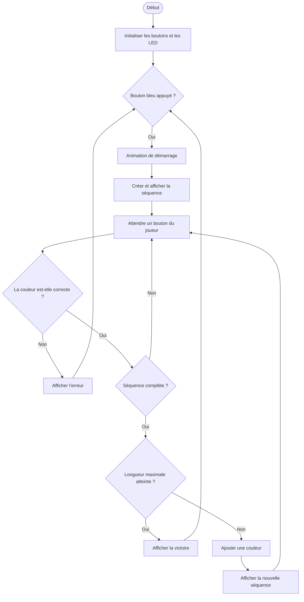

<!-- À FAIRE :
    o Une explication détaillée du schéma électrique
    o Une description détaillée de la stratégie utilisée pour réaliser le projet
    o Le diagramme de flux du code
    o Une conclusion concernant les objectifs atteints et non atteints, ainsi que les améliorations possibles -->

# Documentation

Voici la documentation répondant à ces critères :

* Une explication détaillée du schéma électrique [voir →](#explication-du-schéma-électrique)
* Une description détaillée de la stratégie utilisée pour réaliser le projet [voir →](#comment-je-me-suis-pris-pour-créer-ce-projet)
* Le diagramme de flux du code [voir →](#diagramme-de-flux)
* Une conclusion concernant les objectifs atteints et non atteints, ainsi que les améliorations possibles [voir →](#conclusion)

Ce projet entier a été écrit à la main, par moi, Théo Läderach, avec uniquement la corréction de l'orthographe par une ia.

## Explication du schéma électrique

| Composant         | Pin   | Utilité                                                                                       |
| ----------------- | ----- | --------------------------------------------------------------------------------------------- |
| Boutons-poussoirs | A2-A5 | Déclencher des événements programmés sur la carte, comme allumer les LED ou démarrer la partie |
| LED               | 2-5   | Afficher les couleurs de la séquence                                                            |
| Résistances       | GND   | Réduire la tension des LED pour les préserver                                                   |
| Buzzer            | 7     | Produire un son en même temps qu’une LED s’allume                                               |

## Comment je me suis pris pour créer ce projet

Pour commencer, j’ai placé les boutons sur la carte à bandes afin d’avoir une idée de l’emplacement du reste des composants.
Je les ai ensuite reliés avec les fils, dont j’ai retiré la couche isolante afin qu’ils puissent conduire le courant.

Une fois tous les fils du montage placés, j’ai continué avec les résistances, que j’ai d’abord positionnées et soudées, puis raccourcies.
J’ai ensuite installé le support du buzzer, puis les LED.
Pour commencer, j’ai enfoncé les LED, soudé leurs pattes, puis coupé celles-ci.

Pour les broches, je les ai d’abord mises à ras et droites, puis j’ai soudé les deux extrémités afin de les maintenir aussi droites que possible.
Une fois cela fait, j’ai soudé le reste des broches.
J’ai procédé de la même manière pour les autres composants.

## Diagramme de flux

<!-- Diagramme de flux créé avec Mermaid -->

## Conclusion

J’ai réalisé de bonnes soudures du premier coup, et elles fonctionnaient correctement.
Côté code, mon programme est optimisé et respecte le cahier des charges.

Ce que je pourrais améliorer serait d’ajouter un autre mode de jeu et de réaliser les autres bonus.
Si je n’avais pas aidé tout le monde, j’aurais eu le temps de le faire.
